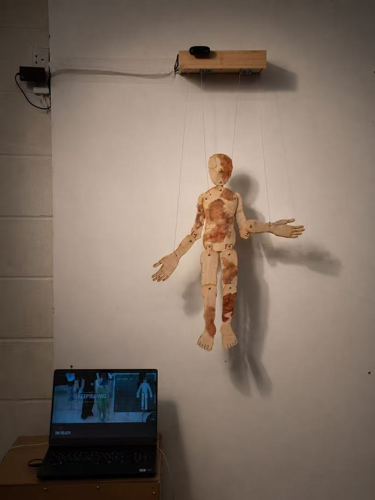

# Hello Again

**Hello Again** is an interactive computational art installation by Jialin Xin. A suspended wooden puppet responds when a visitor waves. Across ten responses, its movement becomes smaller and slower, suggesting physical fatigue. Programmed variation, an unexpected second wind, autonomous movement and refusal make the puppet appear to develop its own behaviour.

## Video documentation

Add the final public or unlisted video URL here:

`https://vimeo.com/1225223447?fl=tl&fe=ec&share=copy`

## Interaction

1. The visitor enters the marked interaction area and waves.
2. A camera captures the visitor in real time.
3. MediaPipe detects the hand and Python analyses its horizontal movement.
4. An accepted wave increases the interaction count and sends a serial command to Arduino.
5. Arduino moves a servo connected to the puppet's arm.
6. The screen displays hand landmarks, body energy, the puppet's thoughts and traces of previous visitors.

Each audience cycle contains ten accepted waves:

- Responses 1–6 gradually reduce the servo angle from 180° to 60°.
- Response 7 produces a sudden double movement called **Second Wind**.
- Responses 8–9 use controlled random angles.
- Response 10 returns the arm to 0° and represents refusal.

A visitor session is registered when its first wave is accepted. After the visitor counter reaches ten and a ten-response cycle is completed, the puppet enters a 30-second **Water Break**.

## Main features

- Real-time hand and upper-body tracking with MediaPipe
- Horizontal wave recognition using tracked hand positions
- Ten-stage fatigue and energy system
- Controlled-random and autonomous puppet movement
- Arduino-to-Python serial communication
- Live puppet-state and interaction interface
- Temporary collective-memory windows with visitor IDs
- Automatic visitor handover and abandoned-session reset
- Thirty-second Water Break after ten registered sessions

## System

```text
Audience wave
    ↓
Camera and MediaPipe
    ↓
Python gesture and behaviour system
    ↓
Serial command
    ↓
Arduino Mega and servo
    ↓
Physical puppet movement
```

## Hardware

- Windows computer
- USB camera
- Arduino Mega
- Servo motor
- External regulated 5 V servo power supply
- Laser-cut wooden puppet
- Suspension line and wooden enclosure

### Servo wiring

- Signal: Arduino Mega pin D9
- Servo power: external 5 V supply
- Servo ground: external supply ground
- Arduino ground: connected to the external supply ground

Do not power a high-load servo directly from the Arduino 5 V pin.

## Software

- Python
- OpenCV
- MediaPipe 0.10.21
- NumPy
- pySerial
- Pillow
- Arduino Servo library

## Repository structure

```text
HELLO_AGAIN_/
├── README.md
└── Hello again/
    ├── PUPPET_EXHIBITION_BUILD.py
    ├── PUPPET_BUILD_REQUIREMENTS.txt
    ├── START_PUPPET_BUILD.bat
    └── PUPPET_BUILD/
        └── PUPPET_BUILD.ino
```

`PUPPET_VISITOR_COUNTER.json` is generated while the program is running. It stores only the next numerical visitor ID and is not required in the repository.

## Installation

### 1. Download the project

Clone the repository or download it as a ZIP:

```bash
git clone https://github.com/Jialinkook/HELLO_AGAIN_.git
```

### 2. Install the Python dependencies

Open a terminal inside the `Hello again` folder and run:

```bash
py -m pip install -r PUPPET_BUILD_REQUIREMENTS.txt
```

### 3. Upload the Arduino program

1. Open `PUPPET_BUILD/PUPPET_BUILD.ino` in Arduino IDE.
2. Select the Arduino Mega and its correct port.
3. Upload the program.
4. Close Arduino Serial Monitor before starting Python.

### 4. Check the device settings

At the top of `PUPPET_EXHIBITION_BUILD.py`, confirm:

```python
SERIAL_PORT = "COM3"
CAMERA_INDEX = 0
```

Change these values if Windows assigns a different Arduino port or camera index. Camera indices `0`, `1` and `2` are common.

## Running the installation

Double-click:

```text
START_PUPPET_BUILD.bat
```

The expected terminal message is:

```text
RUNNING BUILD 5.3: 15 FPS / 5S THANK YOU / VISITOR CHANGE
```

## Operator controls

| Key | Action |
|---|---|
| `N` | Manually advance one audience response |
| `T` | Test one ordinary 180° servo movement |
| `B` | Test the Second Wind double movement |
| `C` | Restart the current audience cycle |
| `F` | Toggle fullscreen |
| `H` | Show or hide diagnostics and shortcuts |
| `Q` / `Esc` | Quit |

## Data and privacy

The project does not use facial recognition. It compares a temporary torso-colour histogram to support visitor handover. One representative camera image per registered session may appear in the collective-memory interface, but these images and the histogram are kept only in memory and are not saved to disk. The only persistent data is the next numerical visitor ID.

## Technical references and acknowledgement

The system uses [MediaPipe](https://github.com/google-ai-edge/mediapipe), [OpenCV](https://opencv.org/), [Arduino Servo](https://docs.arduino.cc/libraries/servo/) and [pySerial](https://pyserial.readthedocs.io/). Full creative and theoretical references are provided in the project documentation PDF.

OpenAI ChatGPT was used to assist with debugging and organising the code. All final design decisions, code modifications, physical construction and testing were completed by the author.

## Author

Jialin Xin  
MA/MFA Computational Arts, Goldsmiths, University of London

